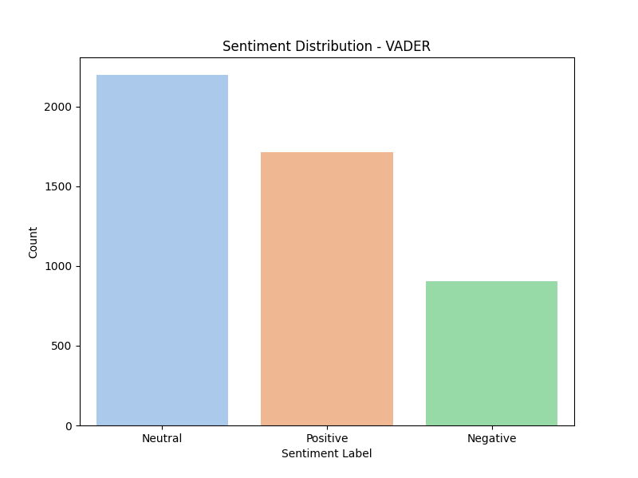
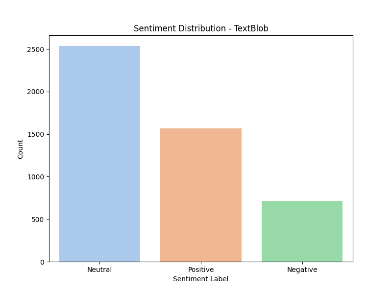

# sentiment-analysis-experiments
A repository for experimenting with various sentiment analysis techniques using NLP libraries like VADER, TextBlob, and spaCy.

# NLP Sentiment Analysis

This project analyzes sentiment in text data using three NLP libraries: VADER, TextBlob, and spaCy. The analysis is performed on the provided dataset named `test.csv`. Sentiment labels (Positive, Negative, Neutral) are assigned, and visualizations showcase the distribution of sentiment labels for each method.

## Analysis Steps
1. Load and explore the dataset.
2. Apply VADER sentiment analysis.
3. Apply TextBlob sentiment analysis.
4. Apply spaCy sentiment analysis.
5. Label sentiment.

## Visualizations
### VADER Sentiment Distribution

### TextBlob Sentiment Distribution

### spaCy Sentiment Distribution

## Results
Sentiment analysis results are saved in separate CSV files for each method.

## Usage
1. Clone the repository: `git clone https://github.com/your-username/your-repo.git`
2. Install dependencies: `pip install -r requirements.txt`
3. Run the notebook or scripts for sentiment analysis.

## Contributing
Contributions are welcome! Open issues or submit pull requests.

